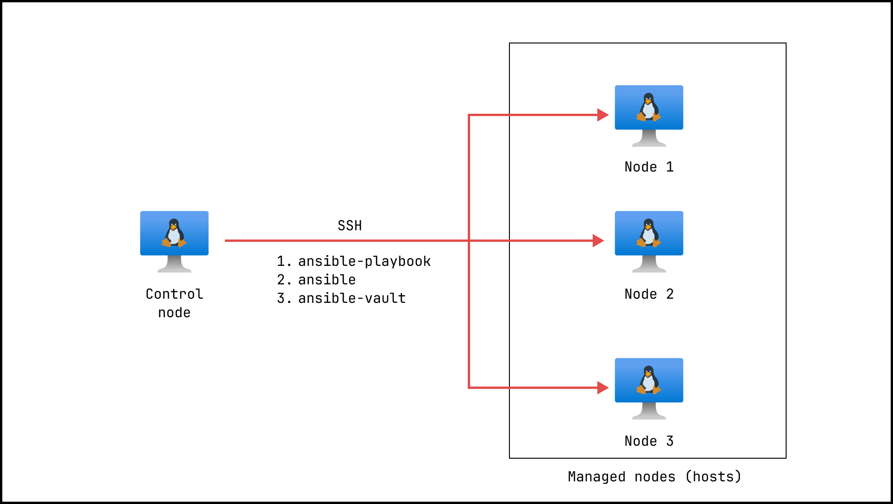

# Ansible Control Node

Gameplay with Ansible control node and multiple managed nodes.

## Related repositories

- https://github.com/kolosovpetro/packer-azure-windows-image
- https://github.com/kolosovpetro/azure-windows-vm-terraform

## Infrastructure

- Control node (SSH key authentication)
- DB server (Password authentication -> then copy id to be executed)
- Web server (Password authentication -> then copy id to be executed)
- Windows DB server (RDP)
- Windows Web server (RDP)

## DNS

- ansible.control.node.razumovsky.me
- ansible.dbserver.razumovsky.me
- ansible.webserver.razumovsky.me
- ansible.win.dbserver.razumovsky.me
- ansible.win.webserver.razumovsky.me

## SSH configuration for Linux managed nodes

From control node execute:

- Update `known_hosts` file by removing the old entries (if necessary)
- ssh razumovsky_r@ansible.control.node.razumovsky.me
- ssh-keygen
- ssh-copy-id -i ~/.ssh/id_rsa razumovsky_r@ansible.dbserver.razumovsky.me
- ssh-copy-id -i ~/.ssh/id_rsa razumovsky_r@ansible.webserver.razumovsky.me

## Control node initial configuration (Linux)

- Copy SSH key and configure permissions
    - `scp "$env:USER_DIRECTORY/.ssh/id_rsa" razumovsky_r@ansible.control.node.razumovsky.me:~/.ssh`
    - `ssh razumovsky_r@ansible.control.node.razumovsky.me "chmod 600 ~/.ssh/id_rsa"`
    - `ssh razumovsky_r@ansible.control.node.razumovsky.me`
- Validate Python installation
    - `git clone git@github.com:kolosovpetro/ansible-control-node.git`
    - `cd ansible-control-node`
    - Run `install_python.sh`
- Install Ansible
    - Run `install_ansible.sh`
- Copy Ansible global configuration file `ansible.cfg`
    - `sudo cp ansible.cfg /etc/ansible/ansible.cfg`
    - `scp ansible.cfg razumovsky_r@ansible.control.node.razumovsky.me:~/ansible.cfg`
    - `ssh razumovsky_r@ansible.control.node.razumovsky.me "sudo cp ~/ansible.cfg /etc/ansible/ansible.cfg"`
- Copy Ansible inventory file `inventory/inventory.yaml`
    - `sudo cp inventory/inventory.ini /etc/ansible/inventory.ini`
    - `scp "inventory/inventory.ini" razumovsky_r@ansible.control.node.razumovsky.me:~/inventory.ini`
    - `ssh razumovsky_r@ansible.control.node.razumovsky.me "sudo cp ~/inventory.ini /etc/ansible/inventory.ini"`
- Update inventory file `inventory/inventory.yaml` if necessary
- Check connection to Linux managed nodes
    - `ansible-playbook ping.yml`
- Windows nodes require additional configuration

## Managed nodes initial configuration (Windows)

- Login to your Windows machines via RDP
- Open PowerShell as Administrator
- Copy script contents from `Configure-Ansible-Host.ps1` to the terminal
- Check connection to Windows managed nodes
    - `ansible windows_servers -m win_ping`

## SSH connection commands (Linux managed nodes)

- ssh razumovsky_r@ansible.control.node.razumovsky.me
- ssh razumovsky_r@ansible.dbserver.razumovsky.me
- ssh razumovsky_r@ansible.webserver.razumovsky.me

## Ansible for Windows Docs

- https://docs.ansible.com/ansible/latest/os_guide/windows_winrm.html
- https://docs.ansible.com/ansible/latest/os_guide/windows_setup.html
- https://github.com/AlbanAndrieu/ansible-windows/blob/master/files/ConfigureRemotingForAnsible.ps1
- Set-ExecutionPolicy -ExecutionPolicy Bypass
- pip install "pywinrm>=0.3.0"

## Provision infrastructure (Terraform)

- Copy your SSH public key to

## Diagram

## Links

- https://trello.com/c/HBFIS51g